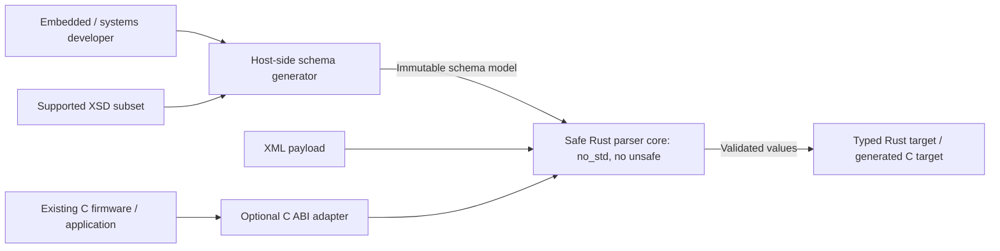
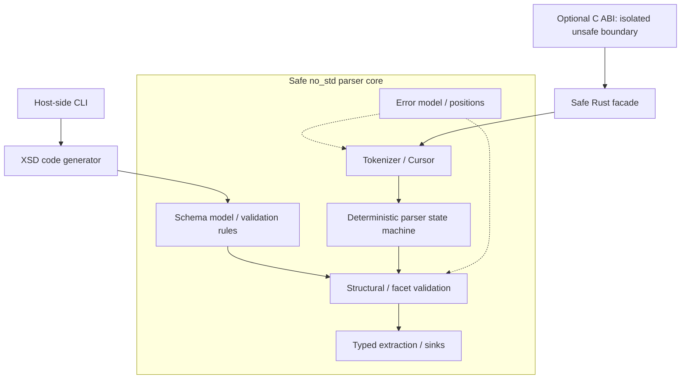
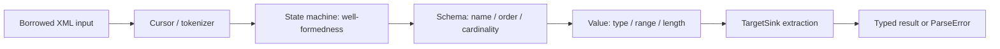
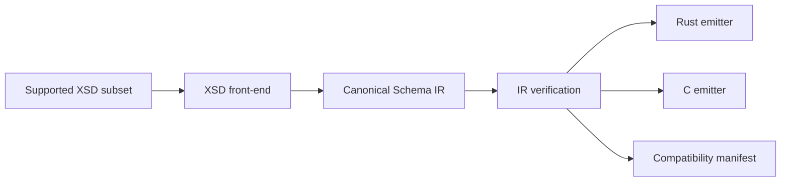

# Architecture

Source: [architecture baseline v0.1, 5 October 2026](reference/embedded-xml-schema_project_specification.pdf), PDF pages 11-13.

Status: documentation baseline. This document records the original proposal or broader v1 plan, while the implemented 0.1.0 scope and evidence are tracked in [milestone-0.1.0.md](milestone-0.1.0.md). The known Rust crate names are `miniml-xml-core` and `miniml-xml`; only ABI names in examples remain proposals.

## Architectural principles

- Safe core, unsafe edge: the parser core contains no unsafe code; FFI is physically separated.

- Dependency inversion: parsing logic depends on traits and immutable schema contracts, not on generated application types.

- Host/target separation: XSD parsing and code generation run on the host; embedded targets receive static generated descriptors.

- Zero-copy by default: borrow input slices unless decoding or type conversion requires materialization.

- Fail closed: unsupported XML/XSD features are rejected explicitly.

- Deterministic resources: resource limits are part of the public contract, not hidden implementation details.

- Testability by construction: state transitions and validators are pure or near-pure components with direct unit entry points.

## System context



Figure 1. System context. The embedded runtime never parses XSD. Schema compilation is a host concern; runtime parsing receives generated, immutable schema descriptors.

## Component architecture



Figure 2. Component boundaries isolate unsafe interoperability from the safe no_std runtime.

## Runtime parsing pipeline



Figure 3. Parsing is modeled as a deterministic pipeline. Each stage can be unit-tested independently and exposes explicit errors instead of panics.

1. Input is wrapped by a bounds-safe cursor. The cursor is the only component that advances byte offsets.

2. Tokenizer emits lightweight events/slices without constructing a DOM.

3. The parser state machine enforces XML well-formedness and matching start/end tags.

4. Schema validation compares events against the current generated SchemaNode and cardinality state.

5. Facet validation converts and checks values before they cross into application targets.

6. TargetSink receives only validated data and constructs the typed result or calls an application hook.

## Schema code-generation architecture



Figure 4. XSD is normalized into a canonical intermediate representation before code emission. This prevents the parser runtime, Rust emitter and C emitter from each implementing schema semantics independently.

| Codegen layer | Responsibility |
| --- | --- |
| XSD front-end | Parse only the documented supported XSD subset; reject unsupported constructs with precise diagnostics. |
| Schema IR | Language-neutral canonical representation of elements, attributes, types, occurrence bounds and facets. |
| IR verifier | Ensures names, references, bounds and layout assumptions are internally consistent. |
| Rust emitter | Generates Rust target types, static Schema descriptors, conversion glue and optional borrowed lifetimes. |
| C emitter | Generates compatibility structures and descriptors with fixed- width types. |
| Manifest emitter | Writes generator/runtime schema ABI version, feature requirements and schema fingerprint. |

## Memory and ownership model

| Concern | Decision |
| --- | --- |
| XML input | Borrowed for duration of parse/result lifetime. |
| Schema | Static generated data in the normal embedded profile. |
| Text values | Borrowed &str when no decoding is required; fixed/caller-owned target for materialized text; owned String only with alloc. |
| Repeated fields | Fixed-capacity target, callback sink, or Vec under alloc. |
| Parser state | Stack-resident bounded state; no hidden globals. |
| Callbacks | Borrowed trait/callback reference; no global callback registry. |
| FFI memory | Caller ownership is explicit. Rust does not free caller memory; Rust-owned opaque objects have matching destroy functions. |

## C ABI boundary

The FFI crate is optional and is intentionally not a mirror of internal Rust types. Its job is migration, not to freeze the internal architecture. All raw pointers are converted to checked slices/options at the boundary and only safe values enter the core.

Optional C ABI - isolated in embedded-xml-schema-ffi

```rust
// Conceptual ABI only
#[no_mangle]
pub unsafe extern "C" fn exs_parse(
    schema: *const exs_schema_t,
    input: *const u8,
    input_len: usize,
    target: *mut core::ffi::c_void,
    config: *const exs_config_t,
    error_out: *mut exs_error_t,
) -> exs_status_t;
```
