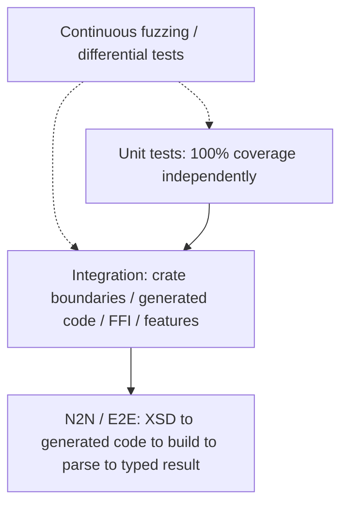

# Test Architecture

Source: [architecture baseline v0.1, 5 October 2026](reference/embedded-xml-schema_project_specification.pdf), PDF pages 15-19.

Status: documentation baseline; the proposed implementation, APIs, builds and quality gates are not yet implemented. Repository name: `miniml-xml-rs`. Crate and ABI names in examples remain proposals from the source.

**Non-negotiable quality gate**

Unit tests must reach 100% coverage of production logic by themselves. Integration tests and N2N/E2E tests are additional confidence layers and may not be used to make the unit coverage number reach 100%.



Figure 5. Test layers. Coverage reports are produced independently for the unit layer and the full workspace.

## Unit-test layer - 100% standalone coverage

Every production branch of parser logic must have a direct unit-test path. Architecture is therefore decomposed into pure or deterministic functions rather than hiding behavior behind a single integration entry point.

| Unit under test | Required coverage |
| --- | --- |
| Cursor / byte reader | Every boundary, EOF case, UTF-8 boundary and position update. |
| Tokenizer | Every token type, whitespace variation, malformed delimiter and truncated form. |
| Entity / character reference decoder | All predefined entities, numeric bases, invalid Unicode and overflow. |
| Name parser | Valid name classes, invalid starts, terminators and edge bytes. |
| State machine | Every legal transition plus every invalid transition. |
| Schema child matcher | Order modes, required/missing child, duplicate, min/max occurrence boundaries. |
| Attribute validator | Required/optional/unknown/duplicate attributes and conversion failures. |
| Value converters | Min/max values, overflow, underflow, signs, bool spellings, whitespace policy. |
| Facet validators | Every inclusive/exclusive bound and string length edge. |
| ResourceBudget | Exact limit, limit+1, zero, arithmetic overflow and repeated consumption. |
| TargetSink adapters | Success, capacity full, callback rejection and borrowed-value behavior. |
| Error positions | Byte/line/column correctness across LF and configured CRLF policy. |
| Schema IR verifier | Every supported rejection rule and every valid node form. |
| Rust/C emitters | Golden output fragments, escaping, identifiers and deterministic ordering. |
| FFI conversion helpers | Null, zero length, valid slices, invalid status mapping and error output. |

Coverage command policy (illustrative):

```sh
# Unit coverage gate only - integration/E2E directories excluded from this run
cargo llvm-cov clean --workspace
cargo llvm-cov --workspace --lib \
  --all-features \
  --fail-under-lines 100 \
  --fail-under-functions 100 \
  --lcov --output-path target/coverage/unit.lcov
# Optional stronger gate where toolchain stability permits it:
# --branch --fail-under-regions 100
```

Generated output is tested through the generator logic and golden/compile tests. Generated files checked into fixtures should not artificially inflate or dilute runtime coverage; coverage inclusion/exclusion must be explicit and documented.

## Property-based tests

- For every valid primitive value, serialize into XML text and verify parse(value) round-trips within the defined lexical format.

- Generated well-formed nested element trees within configured limits must never panic.

- For any input, parser offset must monotonically advance until success or error.

- Increasing a resource limit must not make a previously resource-valid document fail for a stricter resource reason.

- Equivalent entity/character references decode to the same scalar text value where supported.

## Mutation testing

100% coverage is necessary but not sufficient. cargo-mutants (or equivalent) should run on core validation/conversion modules. Surviving mutants indicate weak assertions even if coverage is perfect. Critical modules should target zero surviving non-equivalent mutants before release.

## Fuzzing and differential testing

| Target | Strategy |
| --- | --- |
| Tokenizer fuzz | Arbitrary bytes/UTF-8; invariant: no panic, no out-of-bounds, always terminates under budget. |
| Parser fuzz | Arbitrary XML-like text plus generated schema; same invariants. |
| Structured fuzz | Generate near-valid XML and mutate delimiters, attributes, nesting and lengths. |
| Differential behavior | For the overlapping supported feature set, compare success/failure and extracted values against the original miniML- Parser C implementation. |
| Regression corpus | Every crash, hang, mismatch or security finding becomes a permanent test fixture. |

## Integration tests

Integration tests verify boundaries that unit tests intentionally isolate. They do not participate in the 100% unit coverage gate.

- Facade -> tokenizer -> state machine -> schema validator -> TargetSink using real generated descriptors.

- Core crate with each supported feature combination: default no_std, alloc, std, callbacks, cdata.

- Codegen Schema IR -> Rust emitter -> compile generated Rust fixture.

- Codegen Schema IR -> C emitter -> compile generated C fixture with a C compiler.

- FFI wrapper -> safe core using real pointers created by a controlled C/Rust harness.

- Version manifest mismatch and compatibility checks.

- Cross-crate error propagation preserving error code and source position.

## N2N / E2E tests

N2N is treated here as the full end-to-end path from schema input to a consuming application. These tests should behave as a user would, invoking binaries/build steps rather than internal functions.

| Scenario | End-to-end path |
| --- | --- |
| Rust happy path | food.xsd -> generator CLI -> generated Rust -> compile sample -> parse food.xml -> assert typed fields. |
| Rust rejection | schema -> generated Rust -> parse invalid XML -> assert stable public error code and position. |
| No-alloc embedded profile | schema -> generated fixed-capacity model -> cross-compile no_std sample -> parse host-equivalent fixture under the same capacities. |
| C consumer | XSD -> C artifacts -> build Rust staticlib + C sample -> call C ABI -> assert C structure values. |
| Compatibility differential | Same supported schema/XML -> original miniML C sample and Rust implementation -> compare result/value semantics. |
| Adversarial limits | Generate application -> feed too-deep/too-large/too-many- occurrences XML -> verify deterministic resource errors. |

## Test fixture taxonomy

| Fixture group | Examples |
| --- | --- |
| valid/minimal | Single root, empty allowed content, optional fields absent. |
| valid/boundaries | Exactly min/max numeric values, exact occurrence limits, exact buffer capacities. |
| invalid/syntax | Truncation at every token position, mismatched end tags, bad quotes, illegal references. |
| invalid/schema | Unknown child, wrong order, missing required child, too many occurrences. |
| invalid/value | Overflow, malformed bool/number, facet violation. |
| security | Deep nesting, huge attribute list, billion-laughs-style constructs rejected, oversized numeric references. |
| compatibility | Cases shared with the original miniML examples and behavioral surface. |
| generated | Schemas exercising each supported XSD construct independently and in combinations. |
